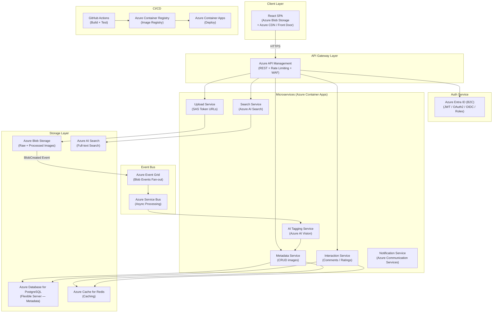
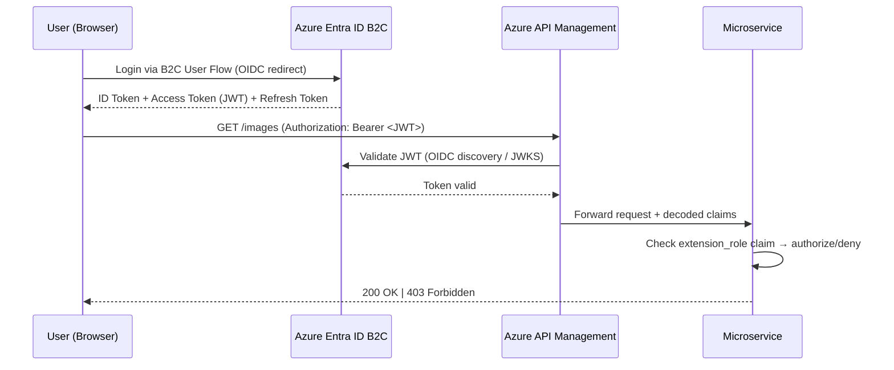
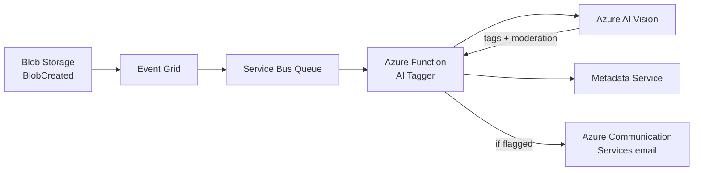

# Cloud-Native Photo-Sharing Application — Complete System Design (Azure)

> **Coursework**  
> Platform: **Microsoft Azure**  
> App Name: **Pixora** — A scalable, cloud-native photo-sharing platform

---

## STEP 1 — System Architecture

### Overview

Pixora is built as a **microservices-oriented, event-driven, cloud-native system** on Azure. No single monolithic service handles everything. Each concern (auth, uploads, metadata, search, AI tagging) is isolated, independently deployable, and horizontally scalable.



### Component-by-Component Breakdown

| Component | Azure Technology | Scalability Rationale |
|-----------|-----------------|----------------------|
| **Frontend** | React SPA on Blob Storage + Azure Front Door | Static assets on CDN edge nodes globally. No server to scale. |
| **API Gateway** | Azure API Management (APIM) | Managed, auto-scaling. Built-in throttling, caching, WAF, OAuth2 validation. |
| **Auth** | Azure Entra ID B2C | Managed OAuth2/OIDC. Scales to millions of users. JWT tokens → stateless auth. Custom policies for Creator/Consumer roles. |
| **Upload Service** | Container Apps (Node.js) | Issues Blob SAS token URLs — uploads go directly to Blob Storage, bypassing the API server. Massive bandwidth saving. |
| **Metadata Service** | Container Apps (Node.js) | Stateless containers. PostgreSQL Flexible Server supports read replicas. |
| **Search Service** | Azure AI Search | Dedicated search cluster, separately scalable from metadata. Full-text + faceted search. |
| **Interaction Service** | Azure Functions (Consumption) | Comments/ratings are event-driven, bursty — scale to zero when idle. |
| **AI Tagging Service** | Azure Functions + Azure AI Vision | Triggered asynchronously via Service Bus after upload. No latency impact on user. |
| **Database** | Azure Database for PostgreSQL Flexible Server | Multi-AZ HA, read replicas, zone-redundant standby, auto-grow storage. |
| **Cache** | Azure Cache for Redis | Enterprise tier with cluster mode, sub-millisecond read latency. |
| **Object Storage** | Azure Blob Storage | Geo-redundant (GRS), lifecycle management, integrated with Azure CDN / Front Door. |
| **Event Bus** | Azure Event Grid + Service Bus | Event Grid for fan-out from Blob events. Service Bus for reliable async messaging with retry/DLQ. |
| **CI/CD** | GitHub Actions + ACR + Container Apps | Automated container build, push, rolling deploy on every merge to main. |

---

## STEP 2 — Tech Stack with Justification

### Frontend

| Choice | Justification |
|--------|--------------|
| **React + Vite** | Component-based, fast HMR, lightweight production bundle |
| **React Query** | Server-state management with automatic caching and background refresh |
| **MSAL.js (Microsoft Auth Library)** | Drop-in Entra ID B2C integration, token management |
| **Hosted on Blob Storage + Azure Front Door** | Zero server costs, global CDN, 99.99% availability, WAF included |

> **Why not Next.js?** SSR requires a server to scale — unnecessary here. SPA + CDN is simpler and cheaper at scale.

### Backend

| Choice | Justification |
|--------|--------------|
| **Node.js (Fastify)** | Non-blocking I/O ideal for upload handling and API fanout. Fastify is faster than Express. |
| **Containerized on Azure Container Apps** | Serverless containers — no VM management, built-in KEDA-based autoscaling, scales to zero |
| **Azure Functions** (interactions, AI triggers) | Event-driven, cost-zero at rest, scales instantly on HTTP or Service Bus triggers |
| **REST API via APIM** | Well-understood, cacheable, Swagger/OpenAPI auto-documentation, policy-based auth |

> **Why not GraphQL?** REST is simpler to cache at APIM level, and Azure API Management has native response caching policies.

### Database

| Choice | Justification |
|--------|--------------|
| **Azure Database for PostgreSQL Flexible Server** | ACID compliant, JSONB for flexible metadata, read replicas, zone-redundant HA |
| **Azure AI Search** | Dedicated full-text and faceted search (tags, location, people, date range) |
| **Azure Cache for Redis** | Feed caching, session cache, rate limiting counters — sub-ms latency |

> **Why not Azure Cosmos DB?** Relational data (images ↔ users ↔ comments ↔ ratings) benefits from foreign keys and joins. PostgreSQL handles this naturally.

### Azure Services

| Service | Purpose |
|---------|---------|
| **Azure Entra ID B2C** | Auth, JWT tokens, user flows, custom role claims |
| **Azure Blob Storage** | Image storage (raw + resized thumbnails), lifecycle policies |
| **Azure Front Door** | Global CDN, WAF, TLS termination, geo-routing |
| **Azure AI Vision** | Auto-tagging (dense captions, tags), content moderation |
| **Azure Service Bus** | Reliable async messaging with retry, DLQ |
| **Azure Event Grid** | Blob creation events fan-out to subscribers |
| **Azure API Management** | Unified entry point, throttling, OAuth2, caching |
| **Azure Container Apps** | Containerized microservices with KEDA autoscaler |
| **Azure Functions** | Event-triggered serverless functions |
| **Azure Container Registry (ACR)** | Container image registry |
| **GitHub Actions** | CI/CD pipelines |
| **Azure Monitor + App Insights** | Metrics, logs, distributed tracing |

---

## STEP 3 — Implementation Phases

### Phase 1 — Foundation (Week 1–2)
- [ ] Azure subscription setup, resource groups, Azure AD B2C tenant
- [ ] Entra ID B2C user flows with `extension_role` custom attribute (Creator/Consumer)
- [ ] Blob Storage containers: `raw-uploads`, `processed`, `$web` (frontend)
- [ ] Azure Front Door profile (frontend + image CDN delivery)
- [ ] PostgreSQL Flexible Server (dev tier, single AZ)
- [ ] Basic React app scaffolded, deployed to `$web` container

### Phase 2 — Core Upload & View (Week 3–4)
- [ ] Upload Service: generate Blob SAS token URLs (POST endpoint)
- [ ] Metadata Service: store/retrieve image metadata in PostgreSQL
- [ ] APIM routes wired to Container Apps services
- [ ] React upload form (Creator role only, guarded by MSAL + Entra ID JWT)
- [ ] Image gallery/feed for Consumers (cursor-paginated)

### Phase 3 — Interactions & Search (Week 5–6)
- [ ] Interaction Function: POST comment, POST rating, GET comments
- [ ] Search Service: index metadata to Azure AI Search on upload
- [ ] Search UI: filter by tags, location, people, date
- [ ] Redis caching for image feed (TTL = 60s)

### Phase 4 — AI Features & Event Pipeline (Week 7)
- [ ] Event Grid subscription on `raw-uploads` container `BlobCreated` event
- [ ] Service Bus queue receives message → triggers Azure Function
- [ ] AI Tagging Function: Azure AI Vision `analyzeImage` → update metadata tags
- [ ] Content moderation: Azure Content Moderator / AI Vision → flag/reject
- [ ] Auto-populate tags field in PostgreSQL after AI analysis

### Phase 5 — CI/CD & Hardening (Week 8)
- [ ] GitHub Actions pipeline: lint → test → Docker build → ACR push → Container Apps deploy
- [ ] Front Door cache purge on frontend deploy
- [ ] APIM rate limiting policies (per-user, per-IP)
- [ ] Azure Monitor dashboards + alerts
- [ ] Load testing with k6

---

## STEP 4 — Database Schema & API Endpoints

### PostgreSQL Schema

```sql
-- Users (managed by Entra ID B2C, mirrored locally for joins)
CREATE TABLE users (
    id          UUID PRIMARY KEY DEFAULT gen_random_uuid(),
    oid         VARCHAR(128) UNIQUE NOT NULL,   -- Entra ID object ID
    email       VARCHAR(255) UNIQUE NOT NULL,
    username    VARCHAR(64) UNIQUE NOT NULL,
    role        VARCHAR(16) NOT NULL CHECK (role IN ('creator', 'consumer')),
    avatar_url  TEXT,
    created_at  TIMESTAMPTZ DEFAULT NOW()
);

-- Images (core entity)
CREATE TABLE images (
    id              UUID PRIMARY KEY DEFAULT gen_random_uuid(),
    creator_id      UUID NOT NULL REFERENCES users(id) ON DELETE CASCADE,
    title           VARCHAR(255) NOT NULL,
    caption         TEXT,
    location        VARCHAR(255),
    blob_url        TEXT NOT NULL,              -- Blob Storage URL
    cdn_url         TEXT NOT NULL,              -- Azure Front Door URL
    thumbnail_url   TEXT,                       -- resized thumbnail
    tags            TEXT[] DEFAULT '{}',        -- AI + manual tags
    people          TEXT[] DEFAULT '{}',        -- tagged people
    ai_status       VARCHAR(32) DEFAULT 'pending',  -- pending|done|flagged
    moderation_flag BOOLEAN DEFAULT FALSE,
    avg_rating      NUMERIC(3,2) DEFAULT 0,
    rating_count    INTEGER DEFAULT 0,
    created_at      TIMESTAMPTZ DEFAULT NOW(),
    updated_at      TIMESTAMPTZ DEFAULT NOW()
);
CREATE INDEX idx_images_creator ON images(creator_id);
CREATE INDEX idx_images_tags ON images USING GIN(tags);
CREATE INDEX idx_images_created ON images(created_at DESC);

-- Comments
CREATE TABLE comments (
    id          UUID PRIMARY KEY DEFAULT gen_random_uuid(),
    image_id    UUID NOT NULL REFERENCES images(id) ON DELETE CASCADE,
    user_id     UUID NOT NULL REFERENCES users(id) ON DELETE CASCADE,
    body        TEXT NOT NULL,
    created_at  TIMESTAMPTZ DEFAULT NOW()
);
CREATE INDEX idx_comments_image ON comments(image_id);

-- Ratings (one per user per image)
CREATE TABLE ratings (
    id          UUID PRIMARY KEY DEFAULT gen_random_uuid(),
    image_id    UUID NOT NULL REFERENCES images(id) ON DELETE CASCADE,
    user_id     UUID NOT NULL REFERENCES users(id) ON DELETE CASCADE,
    score       SMALLINT NOT NULL CHECK (score BETWEEN 1 AND 5),
    created_at  TIMESTAMPTZ DEFAULT NOW(),
    UNIQUE (image_id, user_id)
);
```

### API Endpoints

#### Auth
| Method | Endpoint | Role | Description |
|--------|----------|------|-------------|
| `POST` | `/auth/register` | Public | Register via Entra ID B2C user flow |
| `POST` | `/auth/login` | Public | Login → JWT (MSAL redirect) |
| `POST` | `/auth/refresh` | Public | Refresh access token via MSAL |

#### Upload (Creator only)
| Method | Endpoint | Role | Description |
|--------|----------|------|-------------|
| `POST` | `/uploads/sas` | Creator | Get time-limited Blob SAS URL |
| `POST` | `/uploads/confirm` | Creator | Confirm upload, save metadata |

#### Images
| Method | Endpoint | Role | Description |
|--------|----------|------|-------------|
| `GET` | `/images` | Any | Paginated list (cursor-based) |
| `GET` | `/images/:id` | Any | Single image + metadata |
| `GET` | `/images/search?q=&tags=&loc=` | Any | Full-text + faceted search via AI Search |
| `PUT` | `/images/:id` | Creator (owner) | Update metadata |
| `DELETE` | `/images/:id` | Creator (owner) | Soft delete |

#### Comments
| Method | Endpoint | Role | Description |
|--------|----------|------|-------------|
| `GET` | `/images/:id/comments` | Any | List comments (paginated) |
| `POST` | `/images/:id/comments` | Consumer | Add comment |
| `DELETE` | `/comments/:id` | Owner | Delete own comment |

#### Ratings
| Method | Endpoint | Role | Description |
|--------|----------|------|-------------|
| `POST` | `/images/:id/rate` | Consumer | Rate image (1–5) |
| `GET` | `/images/:id/ratings` | Any | Get aggregate rating |

#### Internal
| Method | Endpoint | Role | Description |
|--------|----------|------|-------------|
| `POST` | `/internal/ai-callback` | Function | AI result callback (Service Bus trigger) |
| `GET` | `/health` | Public | Health check |

---

## STEP 5 — Authentication & Role-Based Access Control

### Architecture: Azure Entra ID B2C + JWT



### Token Structure (Entra ID B2C)

```json
{
  "oid": "azure-object-id-uuid",
  "email": "alice@uni.ac.uk",
  "extension_role": "creator",
  "iss": "https://pixorab2c.b2clogin.com/pixorab2c.onmicrosoft.com/v2.0/",
  "aud": "pixora-api-client-id",
  "exp": 1711999999,
  "iat": 1711996399
}
```

### Role Enforcement Layers

| Layer | Mechanism | What it protects |
|-------|-----------|-----------------|
| **APIM Policy** | Entra ID B2C JWT validation policy | All endpoints require valid JWT |
| **Service middleware** | Extract `extension_role` from token claims | Route-level RBAC (only `creator` can call `/uploads/sas`) |
| **Database** | `creator_id = current_user` check | Prevents cross-user mutations |
| **Blob SAS URL** | Time-limited (15 min), single-blob scoped | Uploads only via API-generated SAS, no direct public write |

### RBAC Matrix

| Action | Creator | Consumer |
|--------|---------|----------|
| View images | ✅ | ✅ |
| Search images | ✅ | ✅ |
| Comment | ✅ | ✅ |
| Rate | ✅ | ✅ |
| Upload image | ✅ | ❌ → 403 |
| Edit own image | ✅ | ❌ |
| Delete own image | ✅ | ❌ |

### Registration Flow

1. User registers via Entra ID B2C **Sign-up/Sign-in user flow**
2. Role is collected as a custom attribute `extension_role` during sign-up
3. A B2C **custom policy** or **API connector** validates the role value and calls Metadata Service to mirror the user into PostgreSQL
4. Subsequent API calls use JWT claims — **no session state on server**

---

## STEP 6 — Advanced Features (5 Selected)

### Feature 1: AI-Powered Auto-Tagging & Content Moderation

**How it works:**

1. Creator uploads image → Blob Storage triggers **Event Grid** `BlobCreated` event
2. Event Grid delivers to **Service Bus** queue (reliable delivery + retry + DLQ)
3. **Azure Function** dequeues the message
4. Function calls **Azure AI Vision `analyzeImage`** → returns tags like `["beach", "sunset", "dog"]`
5. Function calls **Azure Content Moderator** (or Vision's content safety) → flags explicit content
6. Function calls Metadata Service API to update `tags[]` and `moderation_flag`
7. If flagged → image hidden from feed + Creator notified via **Azure Communication Services** (email)



**Why it's cloud-native:** Fully async, zero impact on upload latency. Service Bus retry + DLQ means no AI results are lost.

---

### Feature 2: CDN + Caching Layer

**Two-tier caching:**

| Tier | Technology | What's cached | TTL |
|------|-----------|---------------|-----|
| **CDN** | Azure Front Door | Image files, thumbnails, frontend assets | 24h–7d |
| **App Cache** | Azure Cache for Redis | Image feed, single image metadata, rating aggregates | 60s–300s |

**Redis caching strategy:**

```
Key: feed:cursor:<cursor>:limit:20  → JSON array of image summaries
Key: image:<uuid>                    → Full image object
Key: rating:<uuid>                   → {avg: 4.2, count: 130}
```

**Cache invalidation:** On image update/delete, Metadata Service calls `DEL image:<uuid>` and pattern-deletes feed keys.

**Azure Front Door:** All image URLs served via `https://cdn.pixora.com/<blob-path>`. APIM sits behind Front Door so GET responses are cached at edge (60s TTL via Front Door caching rules).

---

### Feature 3: CI/CD Pipeline (GitHub Actions + Azure)

```yaml
# .github/workflows/deploy.yml

on:
  push:
    branches: [main]

jobs:
  test:
    runs-on: ubuntu-latest
    steps:
      - uses: actions/checkout@v4
      - run: npm ci && npm test

  build-push:
    needs: test
    runs-on: ubuntu-latest
    steps:
      - uses: actions/checkout@v4
      - name: Login to ACR
        uses: azure/docker-login@v1
        with:
          login-server: pixora.azurecr.io
          username: ${{ secrets.ACR_USERNAME }}
          password: ${{ secrets.ACR_PASSWORD }}
      - name: Build & Push
        run: |
          docker build -t pixora.azurecr.io/metadata-service:${{ github.sha }} .
          docker push pixora.azurecr.io/metadata-service:${{ github.sha }}

  deploy:
    needs: build-push
    steps:
      - name: Azure Login
        uses: azure/login@v2
        with:
          creds: ${{ secrets.AZURE_CREDENTIALS }}
      - name: Deploy to Container Apps
        uses: azure/container-apps-deploy-action@v1
        with:
          containerAppName: pixora-metadata
          resourceGroup: pixora-prod-rg
          imageToDeploy: pixora.azurecr.io/metadata-service:${{ github.sha }}
      - name: Purge Front Door Cache
        run: az afd endpoint purge --ids ${{ secrets.AFD_ENDPOINT_ID }} --content-paths "/*"
```

**Pipeline stages:** `Lint → Unit Test → Integration Test → Docker Build → ACR Push → Container Apps Rolling Deploy → Front Door Cache Purge → Teams Notification`

---

### Feature 4: Image Processing Pipeline (Thumbnail Generation)

**Azure Function triggered by Event Grid `BlobCreated` on `raw-uploads` container:**

1. Downloads the raw image from Blob Storage
2. Uses **Sharp** (Node.js) to resize: 800×600 (display) + 300×300 (thumbnail)
3. Writes resized images to `processed` container
4. Calls Metadata Service to update `thumbnail_url` and `cdn_url`

**Blob Lifecycle Policy** on `raw-uploads`: delete after 7 days → cost saving. `processed` container: retained indefinitely.

---

### Feature 5: Observability — Azure Monitor + Application Insights

**Three pillars:**

| Pillar | Technology | What you get |
|--------|-----------|-------------|
| **Metrics** | Azure Monitor Metrics | Request rate, latency p50/p95/p99, error rate, Container Apps replica count |
| **Logs** | Log Analytics Workspace | Structured JSON logs, KQL queryable across all services |
| **Traces** | Application Insights (distributed tracing) | End-to-end request tracing across Container Apps, Functions, Service Bus |

**Auto-scaling trigger:** Container Apps uses **KEDA** (Kubernetes Event-Driven Autoscaling) built-in:
- HTTP scaler: scale on concurrent HTTP requests
- Service Bus scaler: scale Function replicas based on queue depth

**Custom dashboard in Azure Portal:** API requests/min, PostgreSQL CPU, Redis hit rate, AI Vision job queue depth.

---

## STEP 7 — Deployment Strategy

### Infrastructure as Code: Bicep (or Terraform)

All infrastructure defined as code in `/infrastructure/bicep/`. Reproducible across environments.

```bash
# Deploy entire platform to Azure
az deployment group create \
  --resource-group pixora-prod-rg \
  --template-file main.bicep \
  --parameters env=prod
```

### Environment Strategy

| Environment | Purpose | Scale |
|------------|---------|-------|
| **dev** | Local + cloud dev | 1 Container App replica, Basic PostgreSQL, no Redis |
| **staging** | Pre-prod validation, load testing | 2 replicas, Redis Standard, AI Search Basic |
| **prod** | Live system | KEDA autoscaling, Zone-redundant PostgreSQL HA, Redis Enterprise |

### Deployment Steps (Production)

```
1. Developer pushes to main
2. GitHub Actions → run lint + tests
3. Docker image built, tagged with git SHA, pushed to ACR
4. Bicep what-if run to preview any infrastructure changes
5. Container Apps rolling update:
   - New revision deployed alongside old
   - Traffic gradually shifted (blue/green via revision weights)
   - 0% → 10% → 50% → 100% over 10 minutes
   - Old revision disabled after health checks pass
6. Front Door cache purged for frontend assets
7. Azure Monitor alerts watched for 5 min post-deploy
8. Teams notification: "Deployed metadata-service:abc1234 to prod"
```

### Network Architecture

```
Internet → Azure Front Door (WAF + CDN)
         → Azure APIM (public subnet)
         → Container Apps (VNet-integrated, private)
         → PostgreSQL (private endpoint, no public access)
         → Redis (private endpoint, no public access)
         → Blob Storage (private endpoint for services; public CDN URL for images)
```

PostgreSQL and Redis use **Private Endpoints** — never directly accessible from the internet.

---

## STEP 8 — Demonstrating Scalability in Coursework

### Conceptual Scalability Arguments

**1. Horizontal Scaling — Stateless Services**
- All Container Apps are stateless (JWT auth, no in-memory session)
- KEDA scales replicas from 1 → N automatically based on HTTP load or queue depth
- PostgreSQL read replicas absorb read traffic
- Redis reduces database pressure by 70–80%

**2. Async Decoupling — Event Grid + Service Bus**
- AI tagging and notification decoupled from the critical path
- Upload API returns in <200ms regardless of AI processing time
- Service Bus provides backpressure: messages queue up, DLQ captures failures

**3. CDN Offloading**
- 95%+ of traffic (images, assets) served by Front Door edge PoPs globally
- API backend only handles dynamic requests
- Bandwidth to origin drastically reduced

**4. Database Scaling**
- PostgreSQL Flexible Server autogrows storage (32GB → 16TB)
- Read replicas: write to primary, read from replica(s)
- PgBouncer connection pooling built into Flexible Server

### Practical Demonstrations for Coursework

| Demo | Tool | What to show |
|------|------|-------------|
| **Load test** | [k6](https://k6.io) | 100 VUs, 5 min ramp — RPS, latency, error rate |
| **KEDA auto-scaling** | Azure Portal / `kubectl` | Watch Container App replicas increase under load |
| **Cache effectiveness** | Azure Monitor | Redis hit rate — cold vs warm cache latency delta |
| **CDN performance** | Browser DevTools | Image load time: direct Blob URL vs Front Door edge |
| **Async pipeline** | App Insights traces | Upload response time vs AI processing time (separate spans) |

**k6 Load Test (include in coursework):**

```javascript
import http from 'k6/http';
import { check } from 'k6';

export const options = {
  stages: [
    { duration: '1m', target: 50 },
    { duration: '3m', target: 100 },
    { duration: '1m', target: 0 },
  ],
};

export default function () {
  const res = http.get('https://api.pixora.com/images?limit=20', {
    headers: { Authorization: `Bearer ${__ENV.JWT}` },
  });
  check(res, { 'status 200': (r) => r.status === 200 });
}
```

---

## STEP 9 — Limitations & Future Improvements

### Current Limitations

| Limitation | Reason | Impact |
|-----------|--------|--------|
| **Entra ID B2C vendor lock-in** | Azure-specific auth | Migrating auth to another IdP requires user migration |
| **Single Azure region** | MVP scope | Higher latency for geographically distant users |
| **No video support** | Out of scope | Limits media richness |
| **Basic search ranking** | AI Search Basic tier | Not ranked by relevance/popularity out of the box |
| **No real-time features** | No WebSocket/SignalR | Comments/ratings require page refresh |
| **Manual DB migrations** | No migration tool specified | Risk of schema drift between environments |
| **Single-tenant** | Designed for one university | Multi-tenancy not considered in current schema |

### Future Improvements

| Improvement | Technology | Benefit |
|------------|-----------|---------|
| **Multi-region active-active** | Azure Traffic Manager + paired regions + Cosmos DB (if NoSQL pivot) | <50ms latency worldwide |
| **Real-time notifications** | Azure SignalR Service | Live comment feed, live rating updates |
| **Video support** | Azure Media Services | Transcode uploaded videos to HLS streaming |
| **Recommendation engine** | Azure Machine Learning / Personalizer | "You might like" image recommendations |
| **Semantic search** | Azure OpenAI embeddings + AI Search vector search | Search by natural language description: "dog on beach" |
| **Multi-tenancy** | Tenant isolation at B2C policy + PostgreSQL schema level | Host Pixora for multiple universities |
| **Edge logic** | Azure Front Door Rules Engine | Custom auth checks, image transforms at edge |
| **Service mesh** | Dapr (built into Container Apps) | mTLS between services, pub/sub abstraction, retries |
| **Chaos engineering** | Azure Chaos Studio | Validate resilience: kill replicas, inject latency, fail zones |
| **Cost optimisation** | Azure Reserved Instances + Spot for dev | 40–60% cost reduction on compute |

---

## Azure Service Mapping (AWS → Azure Reference)

| AWS Service | Azure Equivalent | Notes |
|------------|-----------------|-------|
| S3 | **Azure Blob Storage** | GRS for geo-redundancy |
| CloudFront | **Azure Front Door** | Also includes WAF |
| Cognito | **Azure Entra ID B2C** | Custom policies = Cognito Lambda triggers |
| API Gateway | **Azure API Management** | More feature-rich; includes developer portal |
| ECS Fargate | **Azure Container Apps** | KEDA built-in; simpler than AKS |
| Lambda | **Azure Functions** (Consumption) | Event-driven, scale to zero |
| ECR | **Azure Container Registry (ACR)** | Geo-replication available |
| RDS Aurora | **Azure Database for PostgreSQL Flex** | Zone-redundant HA |
| ElastiCache Redis | **Azure Cache for Redis** | Enterprise tier = cluster mode |
| OpenSearch | **Azure AI Search** | Semantic ranking available |
| SNS + SQS | **Event Grid + Service Bus** | Event Grid = fan-out; Service Bus = reliable queuing |
| Rekognition | **Azure AI Vision** | Tags, dense captions, content safety |
| SES | **Azure Communication Services** | Email + SMS + WhatsApp |
| CloudWatch + X-Ray | **Azure Monitor + App Insights** | Log Analytics for KQL queries |
| CDK / CloudFormation | **Bicep / Terraform** | Bicep is Azure-native; Terraform is cloud-agnostic |
| CodeDeploy (Blue/Green) | **Container Apps Revisions** | Traffic splitting built into Container Apps |
| GitHub Actions | **GitHub Actions** | Same — works natively with Azure |

---

*Document generated for Pixora — University Cloud-Native Coursework Project*  
*Architecture target: **Microsoft Azure** | Last updated: March 2026*
